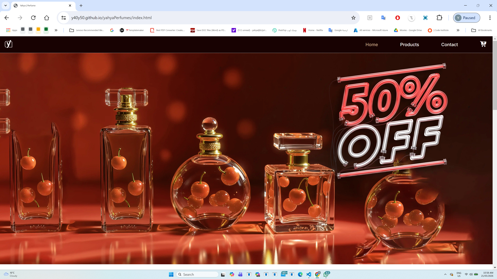
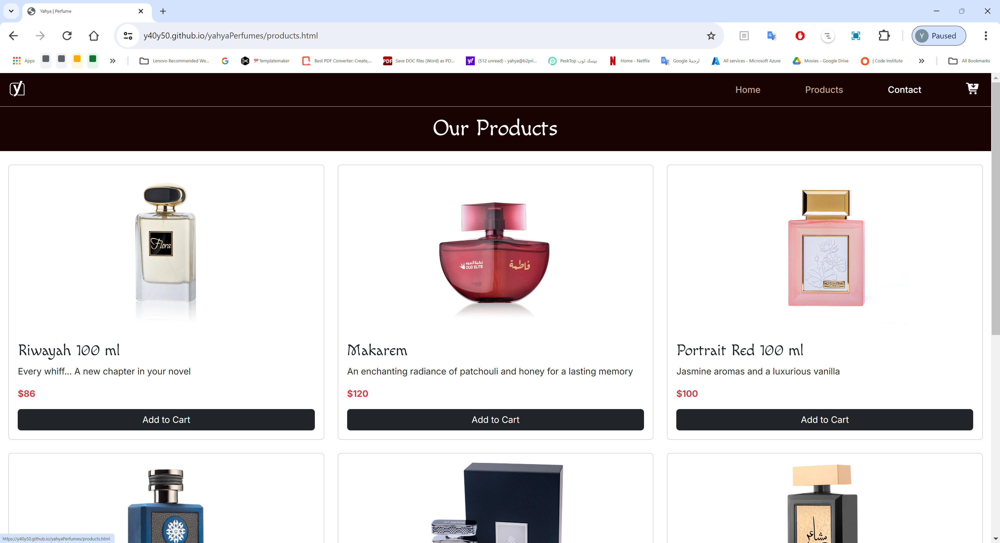
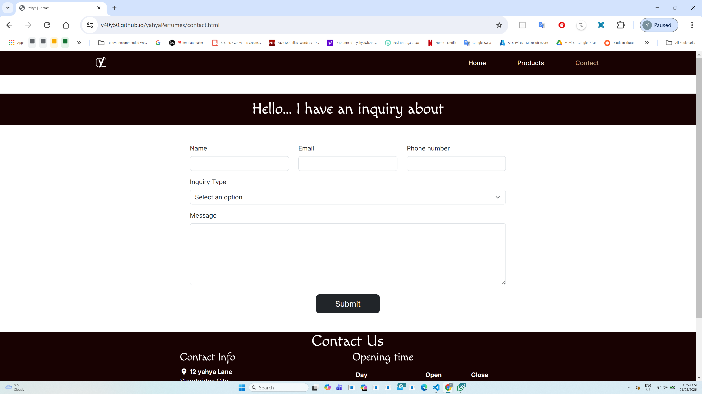
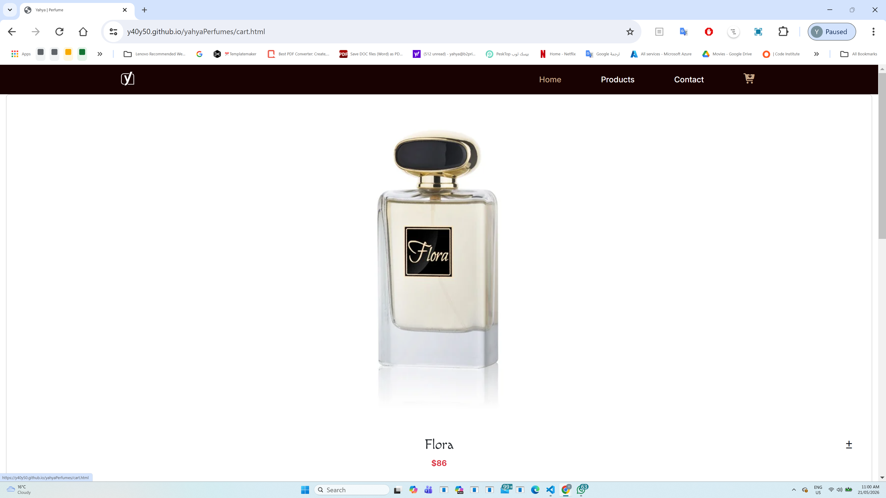
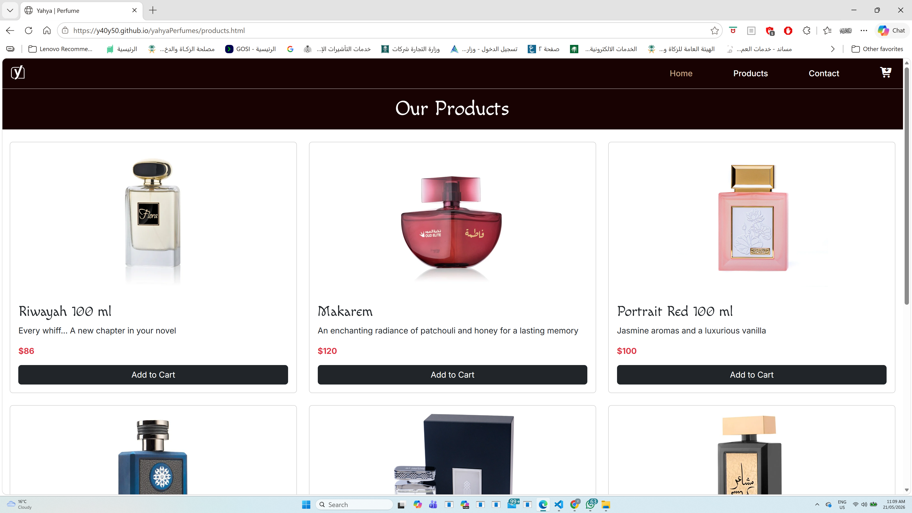
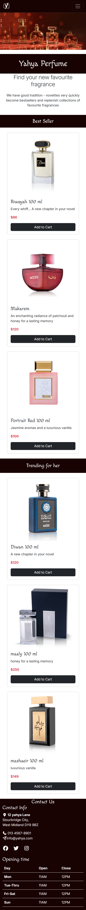
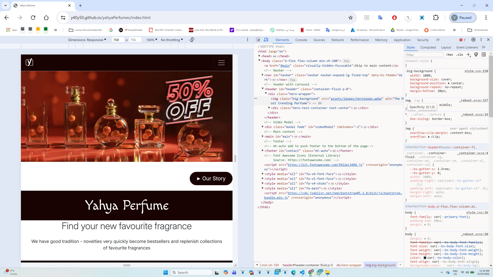
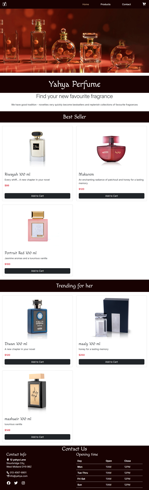

# scaling-fiesta
# Perfume Website – User-Centric Frontend Project

## Project Overview

Yahya Perfumes is a modern front-end perfume website designed to provide users with a clear, elegant, and user-friendly browsing experience.

The website provides value to users by:
- allowing customers to browse perfume products easily
- displaying clear product information and pricing
- providing responsive access across desktop, tablet, and mobile devices
- offering simple and accessible navigation
- helping users quickly find contact and brand information

The website showcases a range of perfume products, brand content, and contact details in a visually appealing layout.
The website is built using **HTML5 and CSS3**, with optional use of **Bootstrap** to support responsive layout and accessibility.

---

## Project Purpose

### External User’s Goal
- Learn about different perfumes and scent types
- Explore perfume collections (men, women, unisex)
- Understand fragrance notes and pricing
- Decide whether to purchase or visit the store

### Site Owner’s Goal
- Promote perfume products
- Build brand identity and trust
- Encourage users to engage with the brand and make contact

The website presents information clearly and attractively to meet both user and business needs.

---

## User Experience (UX) Design

### Target Audience
- Adults interested in perfumes and luxury products
- Customers looking for gifts or personal fragrances
- Users browsing on mobile, tablet, and desktop devices

## User Stories

| ID | User Story |
|----|------------|
| US1 | As a customer I want to browse perfumes so I can choose one |
| US2 | As a customer I want clear navigation so I can find products easily |
| US3 | As a user I want mobile responsive design so I can use my phone |
| US4 | As a customer I want contact information so I can ask questions |
| US5 | As a user I want product prices visible so I can compare |

### UX Design Decisions
- Simple and consistent navigation across all pages
- Clean layout with clear sections and headings
- Luxury-inspired color palette to match the perfume brand
- Readable typography and sufficient spacing
- Responsive design to ensure usability on all screen sizes

## Wireframes

### Homepage Wireframe
[Homepage Wireframe](assets/images/wireframe-home.png)
[Homepage Wireframe](assets/images/wireframe-home1.png)

### Mobile Wireframe
[Mobile Wireframe](assets/images/wireframe-mobile%20(1).png)
[Mobile Wireframe](assets/images/wireframe-mobile%20(2).png)

### Layout Planning
[Layout Planning](assets/images/wireframe-layout_Page3.png)
[Layout Planning](assets/images/wireframe-layout_Page4.png)
[Layout Planning](assets/images/wireframe-mobile_Page2.png)
[Layout Planning](assets/images/wireframe-mobile_Page3.png)
[Layout Planning](assets/images/wireframe-mobile_Page4.png)

## Design Process

Before development the structure was planned to ensure good UX design.

### Home Page Structure

- Navigation bar
- Hero image
- Featured products
- Contact footer

### Products Page Structure

- Product card grid
- Images
- Prices
- Add to cart buttons

### Contact Page Structure

- Contact form
- Required input fields
- Submit button
- Contact information

### UX Design Decisions

Design choices included:

- Simple navigation
- Consistent layout
- Luxury colour theme
- Clear typography
- Responsive grid layout
- Accessibility considerations

---

## Features

### Existing Features

- Responsive navigation bar
- Product cards
- Contact form
- Responsive Bootstrap layout
- Footer contact information
- Social media links
- Hero section with background video and interactive "Our Story" modal.

### Future Features

Possible improvements:

- JavaScript shopping cart
- Product filtering
- Payment system
- Search function
- Database integration

---

## Technologies Used

### Languages

- HTML5
- CSS3

### Frameworks

- Bootstrap 5

### Tools

- Git
- GitHub
- GitHub Pages
- Google Fonts
- Font Awesome

---

## Information Architecture

The site contains 4 pages:

- Home (index.html)
- Products (products.html)
- Contact (contact.html)
- Cart (cart.html)
- Success page

Navigation is consistent across all pages.

---
## Testing

### Manual Testing

| Test ID | Page | Feature Tested | Steps Taken | Expected Result | Actual Result | Pass/Fail |
|----------|------|----------------|-------------|-----------------|---------------|------------|
| T1 | Home | Navigation links | Clicked each navigation link in navbar | Correct pages open | All pages opened correctly | PASS |
| T2 | Home | Images display | Opened homepage and checked images | Images display correctly without stretching | Images displayed correctly | PASS |
| T3 | Home | Responsive layout | Resized browser to mobile/tablet sizes | Layout adjusts correctly | Layout adjusted properly | PASS |
| T4 | Products | Product cards | Opened products page | Product cards display correctly | Product cards displayed correctly | PASS |
| T5 | Products | Add to cart links | Clicked add to cart buttons | Cart page opens correctly | Buttons worked correctly | PASS |
| T6 | Contact | Form validation | Submitted empty form | Validation message appears | Validation worked correctly | PASS |
| T7 | Contact | Required fields | Left required fields blank | Form prevents submission | Form prevented submission | PASS |
| T8 | Contact | Submit button | Submitted completed form | Form submits successfully | Form submitted correctly | PASS |
| T9 | All Pages | Mobile responsive | Tested on mobile screen size | Website remains usable | Website responsive on mobile | PASS |

## Testing Evidence

### Home Page Testing
The homepage navigation, hero section, and layout were tested to ensure all content displayed correctly and navigation links worked properly.

---
### Products Page Testing
Product cards, images, pricing, and add-to-cart buttons were tested to confirm they displayed correctly and linked to the cart page.

---
### Contact Form Testing
The contact form was tested to ensure all fields displayed correctly and form validation worked as expected.

---
### Cart Page Testing
The cart page was tested to ensure products added correctly and layout remained responsive.

## Browser Compatibility Testing
| Browser | Result |
|----------|--------|
| Google Chrome | Working correctly |
| Microsoft Edge | Working correctly |

### Browser Testing Evidence

---
## Responsive Testing
| Device Type | Result |
|-------------|--------|
| Mobile | Layout responsive |
| Tablet | Layout responsive |
| Desktop | Layout responsive |

### Responsive Testing Evidence

## Bugs Found and Fixed

| Bug | Problem | Fix |
|-----|---------|-----|
| Navbar overlap | Header covered content | Added body padding |
| Card alignment | Buttons uneven | Used flexbox |
| Form error | Form inside form | Removed duplicate form |
| Video autoplay | Video not playing automatically | Added muted attribute and used supported format (webp) |
| Modal usability | clear way to close video | Added visible close button using Bootstrap |

---
## Evidence of Design Implementation

## Navigation Design
-  A responsive navigation bar is implemented using Bootstrap
-  Includes links to all main pages (Home, Products, Contact, Cart)
-  Mobile-friendly collapsible menu improves usability

## Page Layout Design
* Semantic HTML structure used:
    - <header> for hero section
    - <main> for content
    - <section> for grouped information
    - <footer> for contact details
* Grid layout used for product display

## Accessibility Design
    - All images include descriptive alt text
    - High contrast colour scheme used
    - Responsive design supports all devices
    - Semantic elements improve screen reader support
    - Navigation accessible via keyboard

## UX Design Implementation
    - Clear visual hierarchy using headings
    - Content prioritised (hero → products → contact)
    - Consistent layout across pages
    - Simple and intuitive navigation
    - Interactive video feature added to improve user engagement
    - "Our Story" button allows users to watch brand-related content.

## Validation

### HTML Validation

HTML was tested using W3C validator.
https://github.com/Y40Y50/yahyaPerfumes/blob/3b9db33785234be707633b5162b5b1e622a3b361/assets/images/Screenshot%202026-03-31%20154726.png
Results:
- No major errors
- Semantic structure correct
- Accessibility structure good

## Screenshot:
[HTML Validation](assets/images/html-validation.png)

### CSS Validation

CSS tested using Jigsaw validator.
https://github.com/Y40Y50/yahyaPerfumes/blob/3b9db33785234be707##633b5162b5b1e622a3b361/assets/images/css%20validation.png
Results:

- No major errors
- CSS variables working correctly
## Screenshot:
[HTML Validation](assets/images/css-validation.png)

---

## Deployment

The project was deployed using GitHub Pages.

### Steps:

1 Create repository on GitHub
2 Upload project files
3 Commit changes
4 Enable GitHub Pages
5 Deploy from main branch
Project link:
https://github.com/Y40Y50/scaling-fiesta

The site is deployed via GitHub Pages. Live Link: https://y40y50.github.io/yahyaPerfumes/

---

## Version Control

Git was used throughout development.

Commits were made to track:

- Layout changes
- Styling improvements
- Bug fixes
- Feature additions

---

## Credits

### Resources Used

Bootstrap:
https://getbootstrap.com/
Google Fonts:
https://fonts.google.com/
Font Awesome:
https://fontawesome.com/

### Images

Images used for educational purposes only.

---

## User Stories with Evidence
## User1 Browse perfumes
    As a customer I want to browse perfumes so I can choose one

## Evidence:
    Products displayed using card layout
    Images, descriptions, and prices clearly visible

## Screenshot:
[Products Page](assets/docs/Products-page.png)

## Clear navigation
    As a customer I want clear navigation so I can find products easily

## Evidence:
    Navigation bar visible on all pages
    Links to Home, Products, Contact, Cart

## Screenshot:
[Home Page](assets/docs/home-page.png)

## Mobile responsive design
    As a user I want mobile responsive design so I can use my phone

## Evidence:
    Responsive Bootstrap layout
    Collapsible mobile menu
## Screenshot:
[Mobile View](assets/docs/mobile-view.png)

## Contact information
    As a customer I want contact information so I can ask questions

## Evidence:
    Address, phone, email clearly displayed
    Social media links included

## Screenshot:
[Contact Page](assets/docs/Contact-page.png)

## View product prices
    As a user I want product prices visible so I can compare

## Evidence:
    Prices clearly shown on each product card

## Screenshot:
[Products Page](assets/docs/Products-page.png)

## View Video
    As a user I want to a video for your story.

## Evidence:
    Video clearly shown our product.

## Screenshot:
[video page](assets/docs/ourstoryvideo.png)

## Development Process

Development followed this order:

1 Planning structure
2 Creating HTML pages
3 Adding CSS styling
4 Adding Bootstrap layout
5 Making responsive design
6 Testing pages
7 Fixing bugs
8 Deployment
9 Adding video modal feature.

---

## Testing Lifecycle

Testing included:

- Manual navigation testing
- Responsive testing
- Form validation testing
- Link testing
- Layout testing

---

## Author

Developed by Yahya Ahmed  
Frontend Development Student Project

---

## Final Notes

This project demonstrates:

- HTML structure
- CSS styling
- Responsive design
- UX design principles
- Testing process
- Version control

